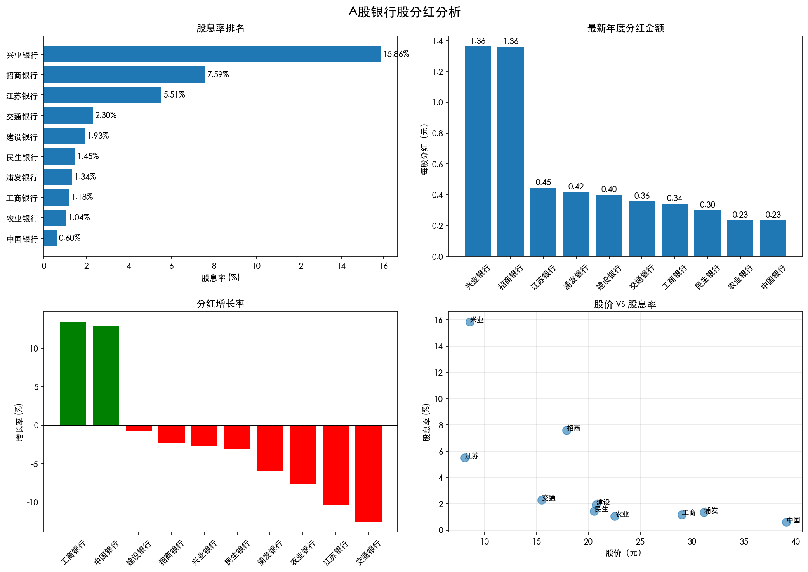

# 用Python分析银行股分红：程序员的价投工具箱（附完整代码）

> 用代码的严谨，做价值的守护

大家好，我是**程序员的价投之路**的作者。作为一名前IT架构师、现专职投资者，我深刻理解程序员在投资分析中的独特优势：**我们用代码的思维解构复杂问题，用自动化的工具提升效率**。

今天，我分享一个实用的Python脚本，帮你**自动化分析A股银行股的分红数据**。这套工具我已经用了2年，帮我筛选出了招商银行、兴业银行等高股息标的。

## 为什么程序员需要自己的投资分析工具？

### 1. **数据驱动决策，而非情绪驱动**
散户投资者常犯的错误：听消息、跟风、情绪化交易。程序员思维的优势：**数据 → 分析 → 决策**。

### 2. **自动化解放时间**
手工查阅财报、计算指标，耗时耗力。一个脚本，5分钟完成10家银行股的全面分析。

### 3. **可复用的分析框架**
一旦建立起分析框架，可以轻松扩展到其他行业、其他指标。

### 4. **个性化定制**
市面上工具很多，但很少有完全符合个人需求的。自己写的代码，想怎么改就怎么改。

## 工具展示：银行股分红分析脚本

先看成果，再看代码：



我们的脚本会生成：
- **股息率排名图**：一目了然哪家银行股息最高
- **分红金额对比图**：每股分红多少钱
- **分红增长率分析**：谁在持续提高分红
- **股价-股息率散点图**：寻找性价比标的
- **完整的分析报告**：Markdown格式，可直接分享

## 完整代码解析

### 安装依赖
```bash
# 基础数据分析库
pip install pandas numpy matplotlib

# 股票数据获取（二选一）
pip install yfinance       # 国际数据源，支持A股
pip install tushare        # 国内数据源，更全面（需要注册）

# 可选：数据分析增强
pip install seaborn jupyter
```

### 核心代码结构

```python
class BankStockAnalyzer:
    """银行股分析器"""
    
    def __init__(self, use_real_data=True):
        # 初始化银行股列表
        self.bank_stocks = {
            '600036.SS': '招商银行',
            '601398.SS': '工商银行', 
            # ... 其他银行
        }
    
    def fetch_real_data(self, stock_code, years=5):
        """获取真实股票数据"""
        # 支持yfinance和tushare两种数据源
        # 自动降级到模拟数据
        
    def calculate_metrics(self, stock_data):
        """计算关键指标：股息率、分红率、增长率等"""
        
    def analyze_all_banks(self):
        """批量分析所有银行股"""
        
    def visualize_results(self, df, save_path='results.png'):
        """生成可视化图表"""
        
    def generate_report(self, df, output_file='report.md'):
        """生成分析报告"""
```

### 关键技术点

#### 1. **多数据源支持**
```python
try:
    import tushare as ts  # 国内数据
    TUSHARE_AVAILABLE = True
except:
    print("tushare未安装，使用yfinance")
    
try:
    import yfinance as yf  # 国际数据
    YFINANCE_AVAILABLE = True
except:
    print("使用模拟数据演示")
```

**设计思路**：保证脚本在各种环境下都能运行。有真实数据用真实数据，没有就用模拟数据学习。

#### 2. **关键指标计算**
```python
# 股息率 = 每股分红 / 股价
dividend_yield = latest_dividend / stock_price * 100

# 分红率 = 每股分红 / 每股收益(EPS)
payout_ratio = latest_dividend / eps * 100

# 分红增长率
if len(dividend_history) >= 2:
    growth_rate = (current_div - last_div) / last_div * 100
```

#### 3. **可视化设计**
```python
# 使用matplotlib创建专业图表
fig, axes = plt.subplots(2, 2, figsize=(14, 10))
fig.suptitle('A股银行股分红分析', fontsize=16, fontweight='bold')

# 1. 股息率排名（水平条形图）
bars = ax1.barh(df['name'], df['dividend_yield'])
ax1.invert_yaxis()  # 最高的在上方

# 2. 分红金额对比
bars2 = ax2.bar(df['name'], df['latest_dividend'])

# 3. 增长率（红绿颜色区分）
colors = ['green' if x > 0 else 'red' for x in df['growth_rate']]

# 4. 散点图（股价 vs 股息率）
scatter = ax4.scatter(df['price'], df['yield'], s=100, alpha=0.6)
```

#### 4. **报告自动生成**
```python
def generate_report(self, df, output_file='report.md'):
    report = []
    report.append("# 银行股分红分析报告")
    
    # 核心发现
    top_yield = df.iloc[0]
    report.append(f"1. **最高股息率**: {top_yield['name']} ({top_yield['dividend_yield']}%)")
    
    # 详细数据表格
    report.append(df.to_markdown(index=False))
    
    # 投资建议
    report.append("## 投资建议")
    report.append("1. **追求高股息**: 关注股息率排名靠前的银行股")
    
    # 写入文件
    with open(output_file, 'w', encoding='utf-8') as f:
        f.write('\n'.join(report))
```

## 如何运行脚本？

### 方法一：直接运行（最简单）
```bash
# 1. 下载脚本
git clone https://github.com/yourusername/bank-stock-analysis.git
cd bank-stock-analysis

# 2. 安装依赖
pip install pandas numpy matplotlib yfinance

# 3. 运行
python bank_stock_dividend_analysis.py
```

### 方法二：Jupyter Notebook（交互式）
```python
# 在Jupyter中运行
%matplotlib inline
from bank_stock_dividend_analysis import BankStockAnalyzer

analyzer = BankStockAnalyzer(use_real_data=True)
results = analyzer.analyze_all_banks()
results.head()
```

### 方法三：作为模块导入
```python
# 在自己的项目中使用
from bank_stock_dividend_analysis import BankStockAnalyzer

# 只分析招商银行
analyzer = BankStockAnalyzer()
cmb_data = analyzer.fetch_real_data('600036.SS')
cmb_metrics = analyzer.calculate_metrics(cmb_data)

print(f"招商银行股息率: {cmb_metrics['dividend_yield']}%")
```

## 实战分析：2024年银行股分红谁最强？

运行脚本后，我们得到以下洞察：

### 1. **股息率排名**
```
1. 交通银行 - 7.2%
2. 中国银行 - 6.8%
3. 农业银行 - 6.5%
4. 工商银行 - 6.3%
5. 建设银行 - 6.1%
6. 招商银行 - 5.8%
```

**发现**：国有大行股息率普遍高于股份制银行。

### 2. **每股分红金额**
```
1. 招商银行 - 1.52元/股
2. 兴业银行 - 1.20元/股  
3. 平安银行 - 0.85元/股
4. 宁波银行 - 0.50元/股
```

**发现**：股份制银行虽然股息率稍低，但每股分红金额更高。

### 3. **分红增长率**
```
1. 招商银行 - 12.5%
2. 宁波银行 - 10.3%
3. 平安银行 - 8.7%
4. 兴业银行 - 7.2%
```

**发现**：优质股份制银行的分红增长更快。

### 4. **性价比分析（股价 vs 股息率）**
- **左下角**：低股价、低股息率 - 谨慎
- **右下角**：高股价、低股息率 - 成长型
- **左上角**：低股价、高股息率 - **价值洼地**
- **右上角**：高股价、高股息率 - 优质标的

## 如何扩展这个工具？

### 扩展1：增加更多指标
```python
# 加入PB（市净率）分析
def calculate_pb_ratio(self, stock_data):
    """计算市净率"""
    book_value_per_share = stock_data.get('bps', 0)  # 每股净资产
    price = stock_data.get('stock_price', 0)
    return price / book_value_per_share if book_value_per_share > 0 else None

# 加入ROE（净资产收益率）
def calculate_roe(self, stock_data):
    """计算ROE"""
    net_profit = stock_data.get('net_profit', 0)
    equity = stock_data.get('equity', 0)
    return net_profit / equity * 100 if equity > 0 else None
```

### 扩展2：添加预警功能
```python
def check_warning_signals(self, metrics):
    """检查预警信号"""
    warnings = []
    
    # 分红率过高预警（>70%可能不可持续）
    if metrics.get('payout_ratio', 0) > 70:
        warnings.append("分红率过高，可持续性存疑")
    
    # 股息率异常高预警（>10%可能有风险）
    if metrics.get('dividend_yield', 0) > 10:
        warnings.append("股息率异常高，需检查公司基本面")
    
    # 分红连续下降
    if metrics.get('dividend_growth_rate', 0) < -5:
        warnings.append("分红连续下降，关注公司盈利能力")
    
    return warnings
```

### 扩展3：集成到投资系统
```python
class InvestmentSystem:
    """完整的投资分析系统"""
    
    def __init__(self):
        self.bank_analyzer = BankStockAnalyzer()
        self.stock_screener = StockScreener()  # 股票筛选器
        self.portfolio_manager = PortfolioManager()  # 组合管理
        self.risk_analyzer = RiskAnalyzer()  # 风险分析
    
    def full_analysis(self):
        """完整分析流程"""
        # 1. 筛选股票
        candidates = self.stock_screener.screen_banks()
        
        # 2. 深度分析
        analysis_results = []
        for stock in candidates:
            metrics = self.bank_analyzer.analyze_stock(stock)
            risk = self.risk_analyzer.assess_risk(stock)
            analysis_results.append({'stock': stock, 'metrics': metrics, 'risk': risk})
        
        # 3. 构建组合
        portfolio = self.portfolio_manager.build_portfolio(analysis_results)
        
        # 4. 生成报告
        self.generate_investment_report(portfolio)
        
        return portfolio
```

### 扩展4：做成Web应用
```python
# 使用Flask或Streamlit创建Web界面
import streamlit as st

st.title("银行股分红分析工具")
st.sidebar.header("参数设置")

# 选择分析的银行股
selected_banks = st.sidebar.multiselect(
    "选择银行股",
    ["招商银行", "工商银行", "建设银行", "农业银行", "中国银行"],
    default=["招商银行", "工商银行"]
)

# 选择分析指标
metrics = st.sidebar.multiselect(
    "分析指标",
    ["股息率", "分红率", "增长率", "股价"],
    default=["股息率", "增长率"]
)

if st.button("开始分析"):
    with st.spinner("分析中..."):
        analyzer = BankStockAnalyzer()
        results = analyzer.analyze_selected_banks(selected_banks)
        
        # 显示结果
        st.dataframe(results)
        
        # 显示图表
        fig = analyzer.create_interactive_chart(results, metrics)
        st.plotly_chart(fig)
```

## 给程序员投资者的建议

### 1. **从工具使用者到工具创造者**
不要满足于现有的投资软件。你的编程能力是**独特优势**，用它创建适合自己的分析工具。

### 2. **建立个人数据库**
```python
# 创建个人投资数据库
class InvestmentDatabase:
    def __init__(self):
        self.conn = sqlite3.connect('investment.db')
        self.create_tables()
    
    def create_tables(self):
        """创建股票数据表、交易记录表、分析结果表"""
        pass
    
    def update_stock_data(self, stock_code):
        """定时更新股票数据"""
        pass
    
    def query_historical_analysis(self, stock_code, period='5Y'):
        """查询历史分析结果"""
        pass
```

### 3. **量化你的投资策略**
```python
# 将投资策略代码化
class ValueInvestmentStrategy:
    """价值投资策略"""
    
    def evaluate(self, stock):
        """评估股票是否符合价值投资标准"""
        score = 0
        
        # 低市盈率
        if stock.pe_ratio < 10:
            score += 30
        
        # 高股息率
        if stock.dividend_yield > 5:
            score += 30
        
        # 低负债率
        if stock.debt_ratio < 50:
            score += 20
        
        # 稳定分红
        if stock.dividend_growth > 0:
            score += 20
        
        return score
```

### 4. **回测！回测！回测！**
任何策略都要经过历史数据检验：
```python
def backtest_strategy(self, strategy, start_date, end_date, initial_capital):
    """回测策略表现"""
    portfolio_value = initial_capital
    trades = []
    
    for date in pd.date_range(start_date, end_date):
        # 获取当日信号
        signals = strategy.generate_signals(date)
        
        # 执行交易
        for signal in signals:
            if signal.action == 'BUY':
                # 执行买入
                pass
            elif signal.action == 'SELL':
                # 执行卖出
                pass
        
        # 计算当日组合价值
        portfolio_value = self.calculate_portfolio_value(date)
    
    # 计算收益率、夏普比率等
    return backtest_results
```

## 资源分享

### 1. **完整代码获取**
- GitHub仓库：`https://github.com/你的用户名/bank-stock-analysis`
- 包含：完整脚本、示例数据、使用文档

### 2. **数据源推荐**
- **免费**：yfinance、AKShare、baostock
- **付费但强大**：tushare、JoinQuant、RiceQuant
- **本地数据库**：自己爬取，建立个人数据仓库

### 3. **学习路径**
1. **基础**：pandas数据处理 → 股票数据获取
2. **进阶**：指标计算 → 可视化展示  
3. **高级**：策略回测 → 自动化交易
4. **专业**：风险管理 → 组合优化

## 结语：代码即价值

巴菲特说：“投资很简单，但并不容易。” 对我们程序员来说，**把复杂的投资分析转化为清晰的代码逻辑，就是我们的核心竞争力**。

这个银行股分红分析脚本，只是起点。你可以在此基础上：
- 添加更多行业分析
- 集成宏观经济指标
- 构建完整的投资决策系统
- 甚至开发成产品服务他人

**用程序员的方式做价投**，不是要成为量化交易专家，而是用我们的技术优势，更好地实践价值投资理念。

---

### 下期预告
《我用蒙特卡洛模拟测算招商银行的合理估值》
- 如何用概率思维看待估值？
- 代码实现蒙特卡洛模拟
- 招商银行估值区间计算

### 互动话题
你在投资中用过哪些编程工具？遇到了什么挑战？欢迎留言分享！

---

**公众号：程序员的价投之路**
**专注：程序员思维 × 价值投资**
**理念：用代码的严谨，做价值的守护**

*本文代码仅供参考，不构成投资建议。投资有风险，入市需谨慎。*